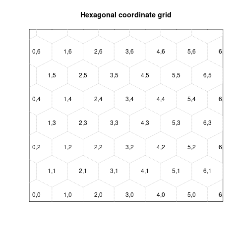
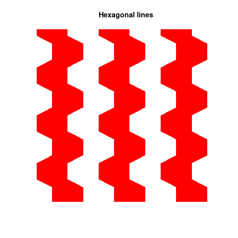
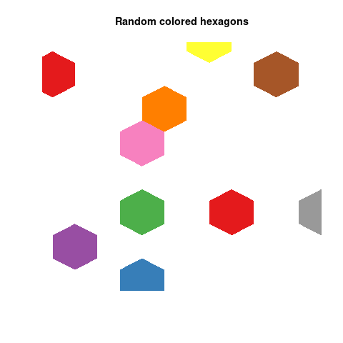

# Hexagonal grid and hexagonal coordinates
Draw a hex, hexagonal grid and use hexagonal coordinates with `hex`, `hexgrid` and `hexcoords`!

## Usage
`source` or `import::from` the `src/hex.r`

To draw a simple hexagon with radius `r=1` at `x=5` and `y=5`, type:

```
plot.new()
plot.window(xlim=c(0,10), ylim=c(0,10))
hex(x=5,y=5,r=1)
```

Alternatively, initialize the hexagonal coordinate system, starting from the `x=5` and `y=5`:
```
coords = hexcoords(r=1, x=5, y=5)
```
Now, we can draw hexagons using their grid coordinates. To draw the same hexagon as before, we use `x=0` and `y=0`, while parsing the `coords` to the `hex` function:

```
plot.new()
plot.window(xlim=c(0,10), ylim=c(0,10))
hex(x=0, y=0, r=1, coords=coords)
```
This is because the hexagonal coordinate system `hexcoords` was initialized with the `x=5` and `y=5` as a center of the hexagon with hexagonal coordinates `(0,0)`. This means that `(-1,0)` is a hexagon to the left and `(1,0)` hexagon to the right and so on.

```
hex(x=-1, y=0, r=1, coords=coords)
hex(x=1, y=0, r=1, coords=coords)
```
Using this, we can easily point at a particular hexagon in a grid, without knowing explicitly its real-space coordinates.

See `examples.r` for more examples.

## Examples

### Hexagonal grid
The numers represent the `x` and `y` coordinates in the hexagonal coordinate system.


### Hexagonal lines



### Random colored hexagon

